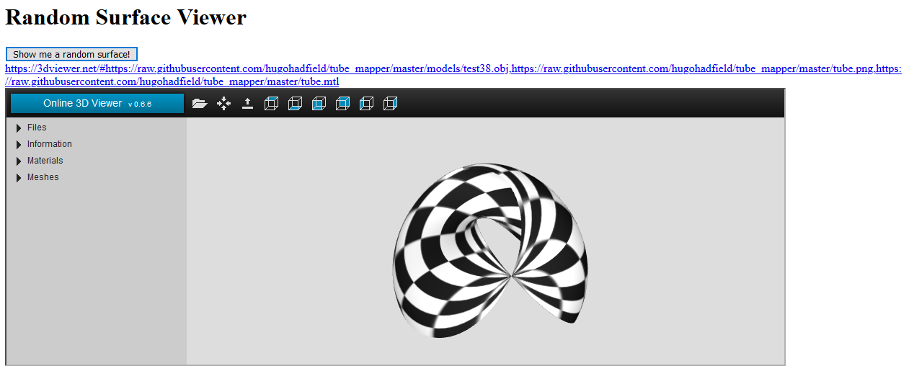

# tube_vis
Random interpolated CGA circles in the browser

## Hosted at
https://hugohadfield.github.io/tube_vis/

## What are they?
Tubular surfaces made by the direct linear interpolation of circles in conformal geometric algebra.
More info on the form of these surfaces available in the paper: [Direct Linear Interpolation of Geometric Objects in Conformal Geometric Algebra](https://link.springer.com/article/10.1007/s00006-019-1003-y)

The code used to generate the .obj files is a part of our toy python raytracer: https://github.com/hugohadfield/raytrace
Specifically, they are generated here: https://github.com/hugohadfield/raytrace/blob/ff16c270b097ff1724425b97490ae2fadf9182f8/scene_objects.py#L668
